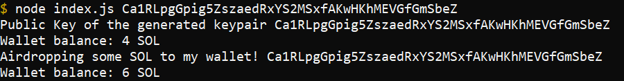

# Keypairs-and-Airdrops
Contains code for the Keypairs and Airdrops lesson from the Metacrafters beginner Solana course!


# Airdrop Sol with Public Key
```
node index.js Ca1RLpgGpig5ZszaedRxYS2MSxfAKwHKhMEVGfGmSbeZ
```


[](https://gitpod.io/#https://github.com/Metacrafters/Keypairs-and-Airdrops)
